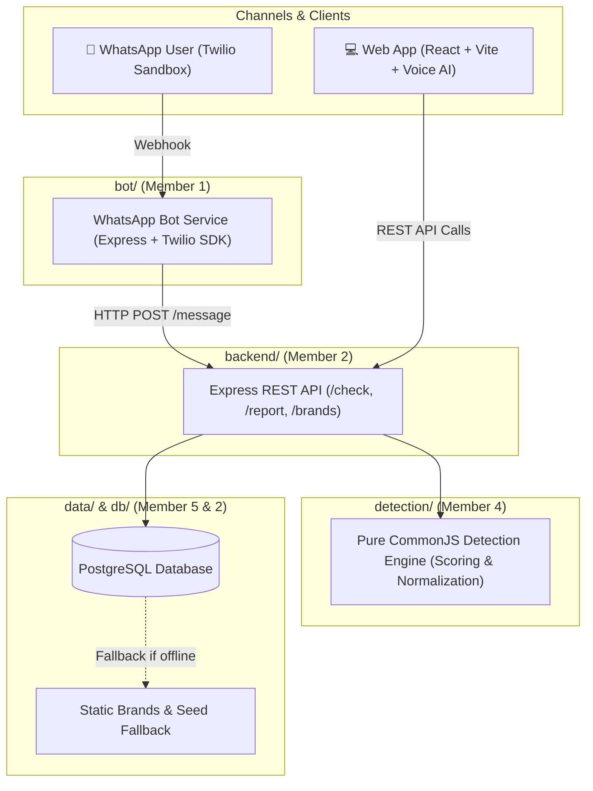

<div align="center">

# 🛡️ DialSafe

**Community-driven protection against fake customer care numbers across India.**  
*A synchronized WhatsApp bot and responsive web application backed by a unified detection engine.*

[](https://nodejs.org/)
[](https://react.dev/)
[](https://vitejs.dev/)
[](https://www.postgresql.org/)
[](https://www.twilio.com/)
[](#testing)
[](#)

[Features](#-key-features) • [Architecture](#-architecture) • [Verdicts](#-verdict-system) • [Team Ownership](#-folder--owner-structure) • [Quick Start](#-quick-start) • [Documentation](#-key-documentation)

---

</div>

## 📌 Overview

DialSafe protects citizens from one of the most prevalent digital fraud vectors: **search-engine spoofing of customer care contact numbers**. When users search online for urgent assistance with banks, delivery apps, or telecom providers, fraudulent numbers often appear in ad placements or unverified results.

With DialSafe, users can:
1. **Verify suspicious phone numbers** instantly to identify scam signals and fraudulent helplines.
2. **Retrieve official, verified customer care numbers** with traceable sources and last-verified timestamps.
3. **Report fraudulent numbers** to protect the broader community in real-time.

Both channels (**WhatsApp Bot** and **Web Application**) communicate with a single backend API and shared PostgreSQL database.

---

## ✨ Key Features

- **🤖 Instant WhatsApp Bot**: Verify numbers and search official helplines on the go via Twilio WhatsApp Sandbox (`hi`, `help`, `report <number>`, or send any number / brand name).
- **🌐 Responsive Web App**: Interactive number checker, brand directory, detailed number profiles, report submission modal, and live incident dashboard.
- **🎙️ Multilingual AI Voice Assistant**: Accessible voice-driven assistance in English, Hindi, and Tamil powered by Google Gemini with zero-config Web Speech API fallback.
- **🧠 Deterministic Detection Engine**: Rule-based scoring engine evaluating number normalization, official directory matching, community reports, and heuristic risk signals.
- **🏢 22 Verified Indian Brands**: Curated directory covering Banking, Payments, Telecom, E-Commerce, Food Delivery, Quick-Commerce, and National Helplines.
- **🚨 Cybercrime Incident Routing**: Integrated advisory directing high-risk targets to call **1930** or report incidents at **[cybercrime.gov.in](https://cybercrime.gov.in)**.

---

## 🏛️ Architecture



---

## 🚦 Verdict System

DialSafe strictly enforces a **4-verdict risk classification**. We **never** declare any number as "safe" — an unconfirmed number is honestly flagged as *Unknown*.

| Verdict | Status | Indicator | Meaning & Criteria |
|---|:---:|:---:|---|
| **Verified official** | 🟢 | Low Risk | Exact match in the brand's verified corporate helpline registry. |
| **High risk** | 🔴 | Danger | Strong scam indicators (e.g., mismatching claimed brand, 3+ community reports, or known scam list). Advised: Never share OTPs/PINs; report to 1930. |
| **Suspicious** | 🟡 | Warning | Warning signs detected (e.g., personal mobile number claiming to be a bank careline, or 1–2 user reports). |
| **Unknown** | ⚪ | Neutral | Unconfirmed number with 0 reports and no verified brand affiliation. Advised to verify via official company app or site. |

---

## 👥 Folder & Owner Structure

Per project governance, each component is owned by a designated team member:

| Folder | Stack / Choice | Responsibilities | Owner |
|---|---|---|---|
| [`bot/`](file:///C:/dial%20safe/bot) | Node.js (18+), Express, Twilio SDK | WhatsApp bot webhook, routing, reply formatting | **Member 1** |
| [`backend/`](file:///C:/dial%20safe/backend) | Node.js (18+), Express, PostgreSQL (`pg`) | REST API routes, database pool, validation | **Member 2** |
| [`frontend/`](file:///C:/dial%20safe/frontend) | React 19, Vite, Vanilla CSS, Gemini AI | Web interface, dashboard, brand directory, Voice AI | **Member 3** |
| [`detection/`](file:///C:/dial%20safe/detection) | Node.js (CommonJS, zero-dependency) | Number normalization, heuristic scoring, risk verdict | **Member 4** |
| [`data/`](file:///C:/dial%20safe/data) | JSON Seed Files (`brands.json`, `sample_reports.json`) | Brand seeds, sample scam reports, data integrity | **Member 5** |
| [`tests/`](file:///C:/dial%20safe/tests) | Node.js test runners | End-to-end and unified cross-module test suites | **Member 5** |
| [`docs/`](file:///C:/dial%20safe/docs) | Markdown | Shared architecture, contracts, decisions, guidelines | **Everyone** |

---

## 🚀 Quick Start

### 1. Prerequisites
- **Node.js** v18+ installed
- **npm** v9+ installed
- *(Optional)* PostgreSQL database instance (Neon, Supabase, or local)

### 2. Clone & Setup Environment
```bash
git clone https://github.com/Pushkar10105/Dial_Safe.git
cd Dial_Safe
cp .env.example .env
```

### 3. Run All Test Suites
DialSafe includes a unified test runner verifying all modules (detection, backend, and bot):
```bash
node tests/run-all.js
```
*(62/62 unit & integration tests across all packages)*

---

### 4. Running Components Locally

#### A. Backend API Server
```bash
cd backend
npm install
npm run dev
# Running on http://localhost:3000 (API Health: http://localhost:3000/health)
```

#### B. Frontend Web Application
```bash
cd frontend
npm install
npm run dev
# Running on http://localhost:5173
```

#### C. WhatsApp Bot Service
```bash
cd bot
npm install
npm run dev
# Or simulate interactions without Twilio via:
npm run simulate
```

---

## 📖 Key Documentation

Before contributing or modifying code, please consult the authoritative documentation:

| Document | Purpose |
|---|---|
| [**`docs/memory.md`**](file:///C:/dial%20safe/docs/memory.md) | Full project context, scope constraints, and background decisions |
| [**`docs/API_CONTRACT.md`**](file:///C:/dial%20safe/docs/API_CONTRACT.md) | The single source of truth for all API request and response shapes |
| [**`docs/DATA_RULES.md`**](file:///C:/dial%20safe/docs/DATA_RULES.md) | Rules for telephone number normalization, sample data, and verified brands |
| [**`docs/DECISIONS.md`**](file:///C:/dial%20safe/docs/DECISIONS.md) | Technical stack choices and timestamped decision log |
| [**`docs/DEMO_SCRIPT.md`**](file:///C:/dial%20safe/docs/DEMO_SCRIPT.md) | 5-step end-to-end evaluation and demonstration flow |
| [**`AGENTS.md`**](file:///C:/dial%20safe/AGENTS.md) | Safety rules, anti-hallucination policies, and folder boundaries for AI assistants |
| [**`CONTRIBUTING.md`**](file:///C:/dial%20safe/CONTRIBUTING.md) | Branching strategy and pull request guidelines |

---

## ⚠️ Important Safety & Compliance Notice

- **Anti-Hallucination & Number Safety**: All official numbers in DialSafe originate from corporate websites with verified sources and timestamps. Test numbers use obvious sample patterns (e.g. `+91 00000 00000`).
- **Never Claim "Safe"**: Detection yields a calculated risk estimate with explanatory reasons. No number is ever labeled "safe".
- **National Cybercrime Helpline**: If you have shared sensitive banking details or OTPs with an unverified party, immediately call **1930** (National Cybercrime Helpline, India) or submit a report at **[cybercrime.gov.in](https://cybercrime.gov.in)**.

